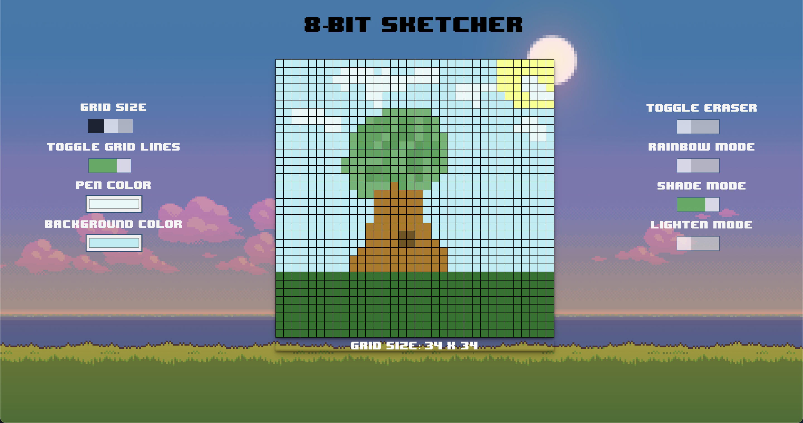

# 8-bit Sketcher

8-bit sketcher is the second javascript project I created for the foundations section of [The Odin Project](https://www.theodinproject.com/lessons/foundations-etch-a-sketch). The code is very rudimentary and written completely in plain HTML/CSS/Javascript. [Working demo here](https://implexrr.github.io/8-bit-sketcher/). 

Please note that I did not add any functionality for mobile devices since that was beyond the scope of the project at the time.



## Installation

To create a copy of the project, type the following command into your terminal:

```bash
git clone git@github.com:implexrr/8-bit-sketcher.git
```

Note that the stylesheet and script link paths in this project will need to be changed in order for the CSS/JS files to render properly.

## Usage/Features
[Give it a try here!](https://implexrr.github.io/8-bit-sketcher/)

- Different canvas sizes
  - Adjust the grid size by dragging the grid size slider. 
  - Grids can be anywhere from 1x1 to 64x64 pixels.
  - Adjusting the grid size will wipe whatever creation you currently have on the canvas.
  - The default grid size is 16 x 16.
- Grid lines
  - Toggle grid lines with the grid toggle on the left side.
  - This effect is purely visual and will not affect your current creation.
- Custom pen colours
  - Easily select your pen colour by clicking on the pen colour wheel.
  - The default pen colour is black.
- Custom canvas colours
  - You can select the colour of your canvas by clicking on the "background colour" button
  - The default canvas colour is a light beige.
- Eraser toggle
- Rainbow mode
  - Don't know what colour you want? Try rainbow mode - every pixel you draw will be filled with a random colour!
- Shade/Lighten modes
  - Add some shading to your sketch by toggling these modes on/off. 

## Things I learnt creating the project

- HTML
  - Input elements
    - Labels
    - Checkboxes
    - Color wheels
  - Sliders
  - Spans vs divs
- CSS
  - Default styles
  - Filtering
  - Flexbox
  - Box Model
  - Transitions
- Javascript
  - Event bubbling
  - Event Listeners
- General Programming
  - Devtools (Chrome, Mozilla)

## Contributing

Pull requests are welcome. For major changes, please open an issue first
to discuss what you would like to change.

Please make sure to update tests as appropriate.

## License

[MIT](https://choosealicense.com/licenses/mit/)